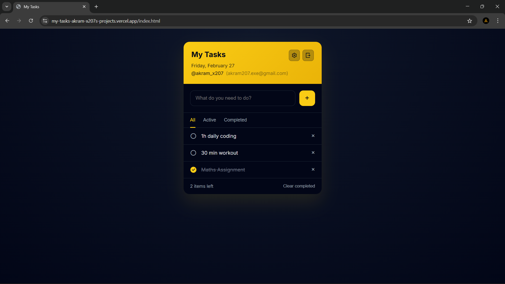
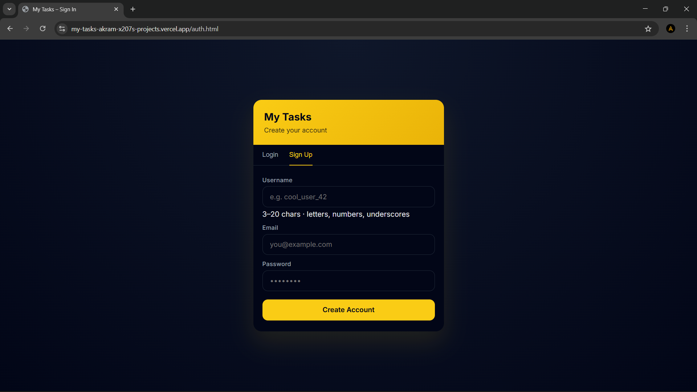

# 📝 My Tasks

<div align="center">
  <p><strong>A sleek, modern, and fully responsive Todo application.</strong></p>
  <p>Built with an emphasis on clean UI/UX, robust backend architecture, and secure user data isolation.</p>

  <a href="https://my-tasks-akram-x207s-projects.vercel.app">
    
  </a>
</div>

<br />

<div align="center">
  
</div>

---

## ✨ Key Features

- **Secure Authentication:** Complete Email & Password authentication flow powered by Supabase Auth.
- **Unique Usernames:** Users create personalized `@usernames` during sign-up with live uniqueness validation.
- **Profile Management:** A dedicated settings panel allowing users to update their username and change their password.
- **Cloud Task Persistence:** Tasks are securely stored in a PostgreSQL database in real-time. Your list is precisely as you left it, across any device.
- **User Data Isolation:** Strict Row Level Security (RLS) policies at the database level guarantee that users *only* access their own tasks.
- **Dark Mode UI:** A gorgeous, eye-friendly dark theme with vibrant yellow accents, smooth micro-interactions, and a fully responsive design.

<div align="center">
  
</div>

---

## 🛠️ Tech Stack

This project was built to demonstrate proficiency across the entire web stack, deliberately avoiding heavy frontend frameworks to showcase a deep understanding of core web technologies.

### **Frontend**
- **HTML5 & CSS3:** Vanilla CSS with custom properties (variables) for consistent theming and flexbox/grid for responsive layouts.
- **Vanilla JavaScript (ES6+):** Complete state management, DOM manipulation, and asynchronous API communication built entirely from scratch.

### **Backend**
- **Node.js & Express.js:** A streamlined, serverless-ready REST API that handles secure communication between the client and the database.
- **JSON Web Tokens (JWT):** Custom Express middleware to intercept, decode, and validate Supabase JWTs attached to requests, ensuring every API call is strictly authenticated.

### **Database & Auth**
- **Supabase (PostgreSQL):** Used for robust user authentication and relational data storage.
- **Row Level Security (RLS):** Enforced at the SQL level to prevent data leakage between accounts.

---

## 🚀 Live Demo

**[Experience the application live on Vercel!](https://my-tasks-akram-x207s-projects.vercel.app)** ⚡

---

## 🎯 Architectural Highlights (For Reviewers)

- **Separation of Concerns:** Cleanly separated `public/` directory (presentation layer) and `api/` directory (modular Express backend).
- **Serverless Ready:** Configured to run effortlessly as stateless AWS Lambda functions via Vercel, allowing for infinite scaling and zero cold-boot delays on static asset delivery.
- **Security First:** The frontend utilizes a tightly scoped public `anon` key, while sensitive backend operations use a Service Role Key actively excluded from the repository.

---

## 💻 Local Development (Quick Start)

If you'd like to run this project locally, follow these simple steps:

1. **Clone the repository:**
   ```bash
   git clone <your-repo-url>
   cd todo-app
   ```

2. **Install dependencies:**
   Ensure you have Node.js installed, then run:
   ```bash
   npm install
   ```

3. **Configure Environment Variables:**
   - Add your Supabase credentials to `public/js/config.js` (`URL` and `Anon Key`).
   - Create a `.env` file in the root directory and add:
     ```env
     URL=your_supabase_url
     SERVICE_ROLE_KEY=your_service_role_key
     PORT=3001
     ```

4. **Start the server:**
   ```bash
   npm start
   ```
   > 🌟 The app will be running at `http://localhost:3001`
